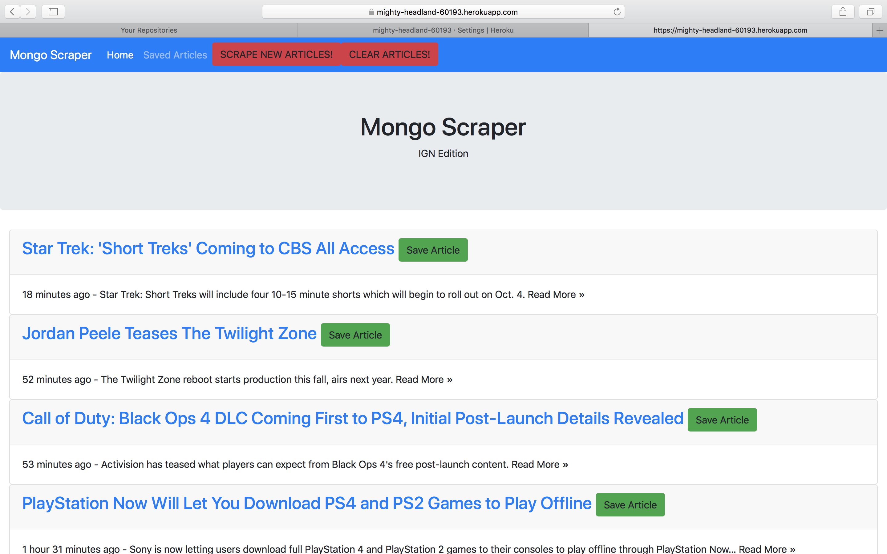

# IGN News Scrapper #

A scrapper that retrieves articles from IGN.com and displays some information and a link. Also allows users can save favoites. 
Built using Node.js and MongoDB.

## Contributors ##

Angel Martinez

## Instructions ##

1. Clone repo.
2. Ensure Node is installed and a MongoDB database is available.
3. First execution will create the appropriate models for Mongo.
6. Using the command line navigate to the News-Scrapper root folder and execute the command "npm install".
6. Once npm installs the packages run the command "node server.js".
7. The command line will display the localhost address/port the server is listening on.
8. In a browser, navigate to the local host address displayed.
9. The application will allow a user to scrape for new IGN articles, clear the articles, save favorites, and each article can link out to its full story in IGN.

